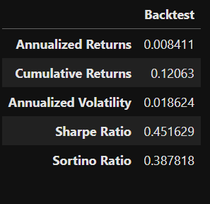

# Rule-Based Stock Trading Strategy with Simulated Performance and Risk Controls
This project implements a fully simulated, rule-based stock trading strategy that generates long and short positions using price and fundamental signals. The strategy includes capital allocation, portfolio rebalancing, and risk controls — all designed to reflect realistic trading desk conditions.

## Objective
To design, test, and evaluate a systematic trading strategy capable of producing consistent profits with defined risk parameters. The project simulates how a trader might manage real capital using a disciplined rules-based approach.

## Key Features
* Long/Short Portfolio Construction
Selects stocks based on fundamental (e.g. P/E, ROE) and technical (e.g. momentum) factors to build a market-neutral or directional portfolio.

* Capital and Risk Management

    * Maximum position size limits

    * Daily rebalancing

    * Stop-loss rules

    * Dollar-neutral long/short exposure

* Performance Tracking

    * Daily P&L simulation

    * Sharpe Ratio, Maximum Drawdown

    * Equity curve visualization

* Backtesting
Strategy is tested over multiple years using historical stock market data to validate robustness and profitability.

## Tools & Libraries
* Python (Pandas, NumPy, Matplotlib)

* Backtesting logic written from scratch for full customization

* Data pre-processing, filtering, and scoring for stock selection

##  Sample Outputs
  *Entry Exit plot on Close Prices*

  *Cumulative Daily Returns*

  *Entry Exit plot on Cumulative Daily Returns*

  
*Performance Metrics*

## Why This Project?
This project was created as part of preparation for a proprietary trading role, where the ability to develop profitable, risk-managed trading strategies is essential. It demonstrates a clear thought process in:

* Strategy creation

* Risk discipline

* Trading performance evaluation

## Author's Note
This strategy reflects the trading mindset required in high-performance trading environments: disciplined execution, risk awareness, and data-driven decision-making.